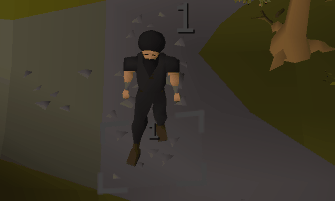
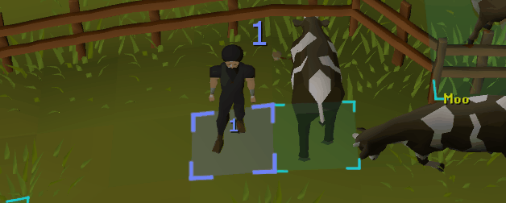

# Tile Overlay Indicators
This repository is now maintained as a standalone plugin.

It originally started from [LeikvollE/tileindicators](https://github.com/LeikvollE/tileindicators), but development here is now independent.

## V.1.1
### Do not draw on specific NPCs 
In cases where you want to avoid drawing on specific NPCs, you can add their names to the "Do not draw on NPCs" list. 
This is useful for situations like earthen shield at doom, vanguards at COX etc.

Wildcard patterns are supported for awkward edge cases, for example Earthen shield:
*shield*
*earthen*

<table>
	<tr>
		<td><strong>NPCs not added to exclusion list</strong></td>
		<td><strong>NPCs added to exclusion list</strong></td>
	</tr>
	<tr>
		<td></td>
		<td></td>
	</tr>
</table>

## V.1.2
### Player tile metronome
The plugin can cycle the local player's true-tile color every game tick while keeping this plugin's own tile style.

You can configure:

- a tile metronome color cycle of 2 to 10 colors
- 10 selectable colors
- two independent player tick counters
- per-counter color sync with the current tile color
- per-counter position
- per-counter X/Y offsets

<table>
	<tr>
		<td></td>
		<td></td>
	</tr>
</table>

