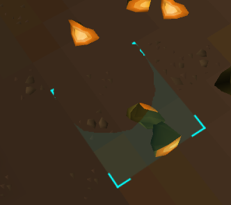
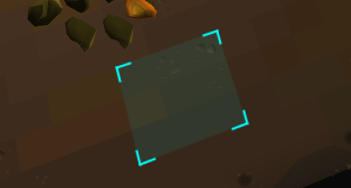
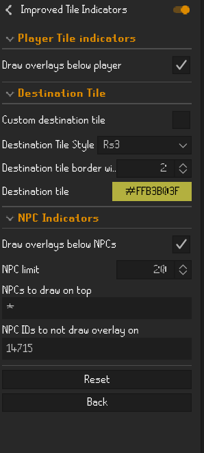

# Improved Tile Indicators
Forked from [LeikvollE/tileindicators](https://github.com/LeikvollE/tileindicators).

Improved integration with better npc highlights.

## Features
### Do not draw on specific NPCs 
In cases where you want to avoid drawing on specific NPCs, you can add their names to the "Do not draw on NPCs" list. 
This is useful for situations like earthen shield at doom, vanguards at COX etc.

NPCs that have not been added to exlusion list:

NPCs that have been added to exlusion list:

